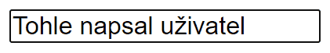
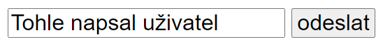

Pokud na vaší webové stránce potřebujete od uživatele získat nějaká data, bude se vám pravděpodobně hodit html prvek `<input>`. V základu zobrazí ná stránce obdélníček, do kterého může uživatel psát text.



Samotné textové políčko ale nestačí. Běžný formulář by měl mít ještě tlačítko pro odeslání a vymezení, kde formulář začíná a končí.

```html
<form>
	<input>
	<button>odeslat</button>
</form>
```



Všechny tři prvky můžou mít nějaké atributy. Většinou se u všech hodí atribut `class` pro jednodušší stylování. CSS se ale zatím zabývat nebudeme.

[[[ excs Cvičení: Textový vstup
- vyhledavac
]]]

[[[ excs Cvičení: Pokročilé formuláře
- statisticky-urad
]]]
