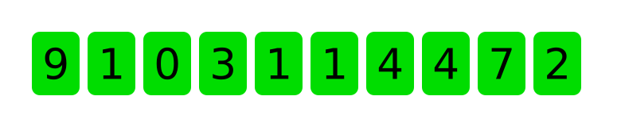

Pokračuje v kódu předchozího příkladu. Budeme chtít zobrazit jednotlivé cifry rodného čísla dle následujícího vzoru.

{.fig .fig-80}

1. Vytvořte čistě JavaScriptovou komponentu `Digit`, která bude představovat jednu cifru rodného čísla. Tato komponenta bude jako svůj parametr brát props s následující strukturou.

   ```js
   {
     char: '3',
     digit: true,
   }
   ```

   Komponentu napište tak, aby vracela řetězec obsahující HTML.

1. Pokud bude prop `digit` mít hodnotu `true`, bude mít znak zelené pozadí a černý text. V opačném případě bude mít červené pozadí a bílý text.
1. V souboru `index.html` vytvořte `div` s nějakým smysluplným `id`, ve kterém budeme zobrazovat jednotlivé cifry. Nastylujte jej pomocí flexboxu tak, abychom mohli cifry zobrazovat vedle sebe.
1. Jakmile uživatel klikne na tlačítko <i>Zkontrolovat</i>, ve vašem programu už máte text zadaný uživatelem převedený na pole. Projděte toto pole pomocí cyklu a naplňte váš připravený `div` ciframi s použitím komponenty `Digit` a vlastnosti `innerHTML`.

Vaše aplikce by měla ve výsledku fungovat tak, že kdykoliv uživatel zadá rodné číslo a nechá si jej zkontrolovat, aplikace vypíše, zda je číslo zadané dobře nebo špatně, a zobrazí jednotlivé znaky čísla s tím, že cifry jsou zelené a špatně zadané znaky jsou červené.
