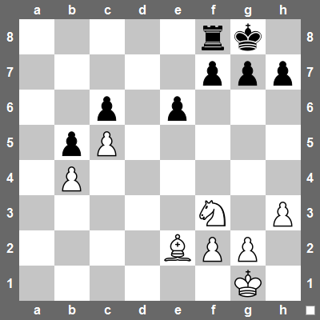

Založte JavaScriptový program a vytvořte v něm pole, které bude reprezentavat rozehranou šachovou partii jako na obrázku.

{.fig .fig-60}

1. Šachovnici reprezentujte jako pole polí, kde každý řádek je reprezentován jako jedno pole. Políčka reprerezentujte jako čísla dle následujícího klíče.
   - 0 - prázné políčko
   - 1 - pěšec
   - 2 - věž
   - 3 - kůň
   - 4 - střelec
   - 5 - dáma
   - 6 - král
1. Otevřete tento program v konzoli a napište příkaz, který přesune bílého koně z pozice f3 na pozici e5.

<!--
Šachové pozice: https://chessfox.com/how-to-play-in-chess-positions-that-feature-material-imbalances/
-->
