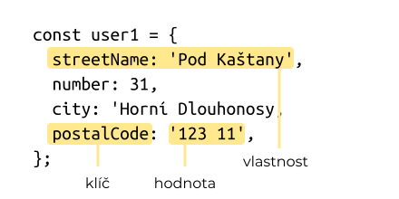

Každý program musí být schopen nějakým způsobem komunikovat s uživatelem - přijímat od něj informace a také informace zobrazovat. V této lekci se naučíme jednoduchý způsob, jak od uživatele získat nějaký vstup do našeho programu. Ukážeme si také, jak získané informace lépe strukturovat pomocí objektů. 

## Vstup a výstup

Zatím jsme viděli, jak může náš program provést jednoduchý výstup pomocí funkce `document.write` nebo `console.log`. Později uvidíme mnohem zajímavější způsoby jak uživateli něco na stránce zobrazit. Nyní ale potřebujeme od uživatele taky nějaký vstup získat. K tomu budeme pro tuto chvíli používat funkci `prompt`. Zkusme napsat program, který bude řešit naši ultramaratonskou úlohu z minulé lekce.

```js
'use strict';

const start = 15;
const delka = prompt('Zadej délku závodu:');
const konec = (start + delka) % 24;
document.write(konec);
```

Tento program vypadá velmi přímočaře. Zadáme-li mu však v dobré víře na vstup délku 10 dočkáme se odpovědi nesprávné odpovědi 22. Abychom odhalili, kde je zakopaný pes, musíme si povědět něco o konverzi hodnot.

## Konverze hodnot

Úplně na začátku je šikovné všimnout si rozdílu mezi hodnotami jako `12` a `'12'`. Jedna představuje číslo dvanáct, druhá představuje řetězec obsahující znaky 1 a 2. Proto můžeme čekat, že aritmetické operace s těmito hodnotami dopadnou jinak podle toho, zda jde o číslo nebo o řetězec.

```jscon
> 12 + 5
17
> '12' + '5'
'125'
```

JavaScript se nám (občas k naší škodě) snaží udělat život jednodušší a tak za nás v určitých případech provádí automatickou konverzi.

```jscon
> '12' + 5
'125'
> 12 + '5'
'125'
> 1 + 2 + 3 + '4'
'64'
> '1' + 2 + 3 + 4
'1234'
```

Tato konverze funguje i pro jiné operátory, napříkad násobení.

```jscon
> 12 * 5
60
> '12' * 5
60
> 12 * '5'
60
> '12' * '5'
60
```

Dokonce takto funguje i zbytek po dělení.

```jscon
> 12 % 5
2
> '12' % 5
2
> 12 % '5'
2
> '12' % '5'
2
```

Vybaveni touto zkušeností můžeme začít rozplétat, co se nám pokazilo na našem ultramaratonském programu. To nejdůležitější k zapamatování je, že funkce `prompt` **vždycky vrací vstup od uživatele jako řetězec**. I když uživatel do políčka nakrásně napíše číslo, funkce `prompt` pro nás žádnou konverzi automaticky nedělá. Pokud tedy uživatel zadal jako délku závodu číslo 10, do proměnné délka se nám uložila hodnota `'10'`. V konzoli si pak můžeme vyzkoušet, co se dělo pak.

```jscon
> const start = 15
> const delka = '10'
> start + delka
'1510'
> '1510' % 24
22
```

Abychom si s touto situací poradili, budeme potřebovat možnost provést konverzi hodnot sami, aniž by nám do toho JavaScript kecal.

### Explicitní konverze

Pokud chceme konvertovat číslo na řetězec, použijeme funkci `String`.

```jscon
> String(12)
'12'
> String(-2.48)
'-2.48'
```

Když potřebujeme obrácenou konverzi, tedy řetězec na číslo, použijeme funkci `Number`.

```jscon
> Number('12')
12
> Number('-2.48')
-2.48
> Number('-2,48')
NaN
```

Všimněte si, co se stane, když se pokusíme zkonvertovat nějaký řetězec, který na číslo převést nejde. V takovém případě obdržíme speciální hodnotu `NaN`, což je zkratka pro <i>Not a Number - Není číslo</i>.

Nyní už můžeme náš program přepracovat tak, aby fungoval správně.

```js
'use strict';

const start = 15;
const delka = Number(prompt('Zadej délku závodu:'));
const konec = (start + delka) % 24;
document.write(konec);
```

Z tohoto příkladu plyne do budoucna velmi důležité poučení. Vždycky si dávejte dobrý pozor na to, s jakými typy hodnot pracujete. Pokud například chcete používat výstup funkce `prompt` jako číslo, vždy jej explicitně převeďte na číslo. Dáte tak i čtenářům vašeho programu najevo, co je vaším záměrem, a oni tak nebudou muset smysl vašeho programu rozplétat jako detektivní zápletku.

Fakt, že JavaScript pro nás některé konverze dělá automaticky, můžeme využít k tomu, abychom uživateli vypsali nějakou hezčí zprávu, než jen holé číslo.

```js
document.write('Běžec dorazí v ' + konec + 'h');
```

[[[ excs Cvičení: Vstup a výstup
- ockovani
- vyplata-stranka
]]]

## Objekty

Prozatím jsme v naších programech pracovali pouze s čísly a řetězci. V reálnějších programech však budeme potřebovat do naších proměných uložit více, než jednu informaci. Představte si například, že chceme evidovat uživatele e-shopu. Každý uživatel má jméno, login a počet položek v nákupním košíku. Takovou informaci bychom mohli zkusit nacpat do jednoho řetězce třeba takto. 

```js
const user1 = 'Lubomír Větvička, lubos, 0';
```

Vysekat z takového řetězce jednotlivé údaje je ovšem dost pracné a našikovné. Pokud chceme informace lépe strukturovat, použijeme v JavaScriptu takzvané objekty. 

```js
const user1 = {
  fullName: 'Lubomír Větvička',
  login: 'lubos', 
  cartItems: 0,
};
```

Objekt vytvoříme tak, že do složených závorek vložíme čárkou oddělené záznamy, kterým se říká <term cs="vlastnosti" en="properties">. Každá vlastnost sestává z takzvaného <term cs="klíče" en="key"> a <term cs="hodnoty" en="value">. 

{.fig .fig-80}

Pomocí klíčů pak můžeme z objektu získat jednotlivé hodnoty použitím takzvané <term cs="tečkové notace" en="dot notation">.

```jscon
> user1.fullName
"Lubomír Větvička"
> user1.login
"lubos"
> user1.cartItems
0
```

Klíče v objektu se chovají podobně jako proměnné. Řídí se stejnými pravidly pro názvosloví. Můžete tedy mí objekty třeba v hadí notací. 

```js
const user1 = {
  full_name: 'Lubomír Větvička',
  login: 'lubos', 
  cart_items: 0,
};
```

Nelze však použít například klíče s pomlčkou.

```js
const user1 = {
  full-name: 'Lubomír Větvička',
  login: 'lubos', 
  cart-items: 0,
};
```

Pokud trváme na tom, že v klíči chceme mít pomlčku nebo dokonce mezeru, můžeme jej uzavřít do uvozovek jako řetězec. 

```js
const user1 = {
  'full name': 'Lubomír Větvička',
  login: 'lubos', 
  'cart-items': 0,
};
```

Potíž je v tom, že k takovým klíčům se už pomocí tečkové notace nedostaneme a musíme použít jiný zápis. 

```jscon
> user1['full name']
"Lubomír Větvička"
> user1.login
"lubos"
> user1['cart-items']
0
```

Tento zápis není tak šikovný jako tečková notace a proto se budeme klíčům v uvozovkách snažit co nejvíce vyhýbat. 

Hodnoty uvnitř objektů lze také měnit. Takto například můžeme zvýšit počet položek v košíku. 

```jscon
> user1.cartItems = 3
```

Všimněte si, že při vytváření objekt ukládáme do proměnné, jde tedy o nový typ hodnoty, podobně jako číslo nebo řetězec. To mimo jiné znamená, že uvnitř objektu můžeme mít vnořené další objekty. Takto bychom mohli například reprezentovat uživatele s doručovací adresou. 

```js
const user1 = {
  fullName: 'Lubomír Větvička',
  login: 'lubos', 
  address: {
    street: 'Nábřežní',
    number: 31,
    city: 'Horní Dlouhonosy ',
    postalCode: '123 11',
  }
  cartItems: 0,
};
```

Kdybychom pak chtěli získat například město, kam máme objednané zboží doručit, opět použijeme tečkovou notaci. 

```jscon
> user1.address.city
"Horní Dlouhonosy"
```

Díky objektům tak můžeme v našich programech reprezentovat i velmi komplikovaná data. 

## Jednoduché destrukturování

Často se nám stane, že chceme z objektu získat vícero hodnot a uložit se je do proměnných, například takto.

```js
const fullName = user1.fullName;
const login = user1.login;
const cartItems = cartItems;
```

Programátoři jsou však líné bytosti a tento postup jim přijde zdlouhavý. Pokud se naše proměnné jmenují stejně, jako klíče uvnitř objektu, můžeme si ušetřit psaní a použít takzvané destrukturování. 

```js
const { fullName, login, cartItems } = user1;
```

Tímto zápisem říkáme, že chceme vyrobit tři proměnné, do kterých se uloží hodnoty z objektu `user1`. 

[[[ excs Cvičení: Objekty
- realitka
- knihovna
- ockovani-objekty
]]]

[[[ excs Doporučené úložky na doma
- formatovac-data
- fahrnheit-vs-celsius
- letenka
]]]

## Shrnutí

Po této lekci byste měli vědět a znát

* jak použít funkci `prompt` k získání vstupu od uživatele,
* jak správně konvertovat hodnoty pomocí funkcí `Number` a `String`,
* jak ukládat informace do objektů a jak k těmto informacím přistupovat pomocí tečkové notace,
* jak vytvářet vnořené objekty,
* jak získat z objektu hodnoty pomocí destrukturování.